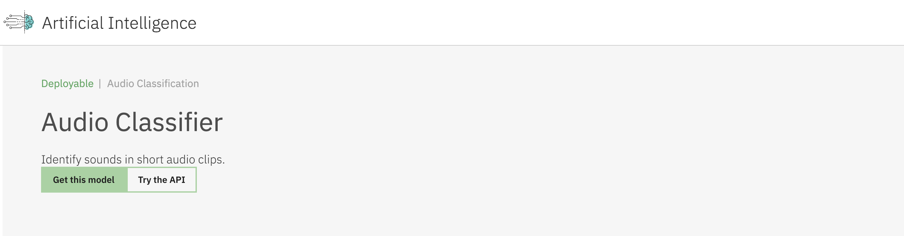
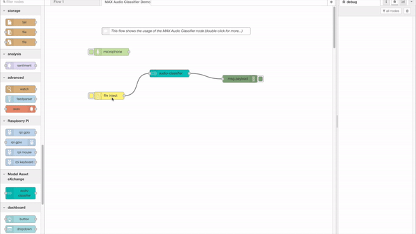

node-red-contrib-max-audio-classifier
=====================


This repo contains a [Node-RED](https://nodered.org/) node that wraps the functionality of the [MAX Audio Classifier](https://developer.ibm.com/exchanges/models/all/max-audio-classifier/) from the [Model Asset eXchange](https://developer.ibm.com/exchanges/models/) (MAX) in a form that can be used within a Node-RED flow.

The process of creating this node with the Node Generator tool has been documented in a blog post [here](https://medium.com/ibm-watson-data-lab/creating-custom-node-red-nodes-for-your-api-the-easy-way-10770ccd8923). 

Following the steps outlined in the post, you should be able to create your own nodes to wrap any microservice that is defined with an OpenAPI specification. This is a common format used by tools like [Swagger](https://swagger.io/) to document many API's, and this process should allow you to create functional nodes for them with little to no code required.

### About the MAX Audio Classifier
This model recognizes a signed 16-bit PCM wav file as an input, generates embeddings, applies PCA transformation/quantization, uses the embeddings as an input to a multi-attention classifier and outputs top 5 class predictions and probabilities as output. The model currently supports 527 classes which are part of the [Audioset Ontology](https://research.google.com/audioset/ontology/index.html).


Notes:
----
To use this node effectively, you'll need a running instance of the [MAX Audio Classifier](https://developer.ibm.com/exchanges/models/all/max-audio-classifier/) model from the [Model Asset eXchange](https://developer.ibm.com/exchanges/models/). 



If you'd like more information on how to get started with this and other free, open-source deep learning models from the Model Asset eXchange, visit [this tutorial](https://developer.ibm.com/tutorials/getting-started-with-the-ibm-code-model-asset-exchange/).

Install:
-------
Run the following command in your Node-RED user directory - typically `~/.node-red`

``` shell
$ npm install node-red-contrib-max-audio-classifier
```

Usage:
-----
Since this node acts essentially as a wrapper around the MAX Audio Classifier model, it provides the same methods defined in that model's OpenAPI specification, documented with Swagger [here](http://max-audio-classifier.max.us-south.containers.appdomain.cloud/). 

<html>

<h2>get_metadata</h2>
<h3>Inputs:</h3>
<dl class="message-properties">
    <dt><span class="property-type">none</span></dt>
</dl>
<h3>Outputs:</h3>
<dl class="message-properties">
    <dt>payload <span class="property-type">object</span></dt>
    <dd>Prediction.</dd>
</dl>


<h2>predict</h2>
<h3>Inputs:</h3>
<dl class="message-properties">
    <dt>payload <span class="property-type">Buffer</span></dt>
    <dd>Buffer data of 16-bit PCM wav file.</dd>
</dl>
<h3>Outputs:</h3>
<dl class="message-properties">
    <dt>payload <span class="property-type">object</span></dt>
    <dd>Prediction.</dd>
</dl>

</html>

Visit [this link](https://flows.nodered.org/flow/cd64d4bb78a7984f15b3cfa5ac97ae55) at the Node-RED Library for an example flow that uses this node in a typical way. In it, you can identify sounds in audio WAV files or through captured audio from your computer's microphone. The clip below shows a file being sent to the model, with the prediction appearing in the Node-RED debug console on the right-hand side of the screen.  



**NOTE:** To use the `Microphone` and `File Inject` nodes pictured in this example flow, you'll need to add them to your Node-RED palette by installing the `node-red-contrib-browser-utils` package. You can accomplish this from within Node-RED by using the [Palette Manager](https://nodered.org/docs/user-guide/editor/palette/manager) or by running the following command in your Node-RED directory as described above:
``` shell
$ npm install node-red-contrib-browser-utils
```

For more information, visit [the package's page in the Library](https://flows.nodered.org/node/node-red-contrib-browser-utils).